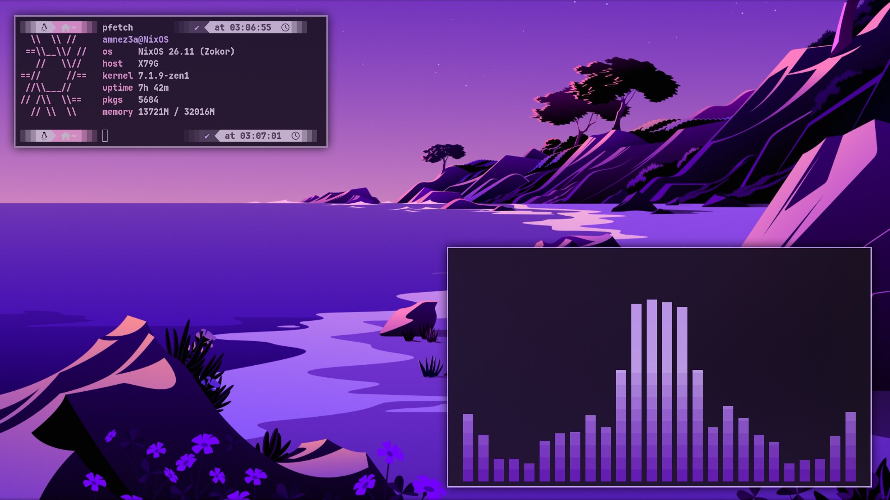
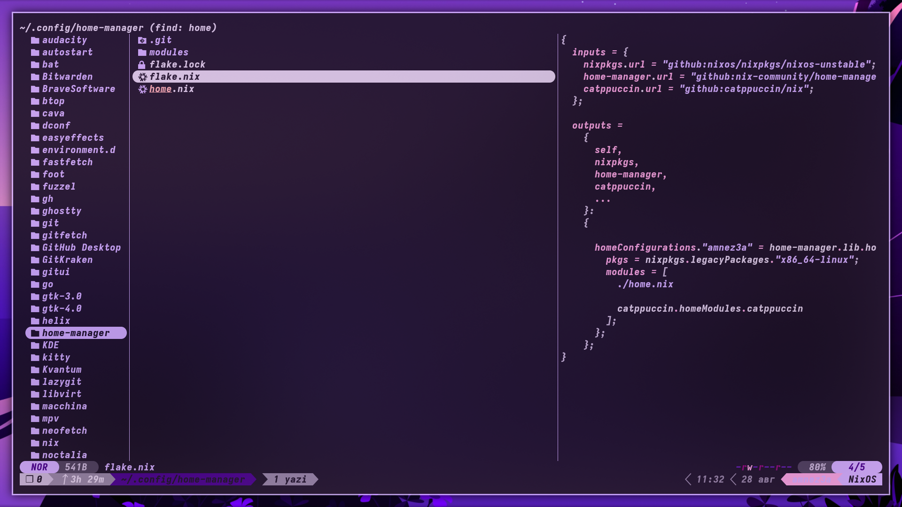
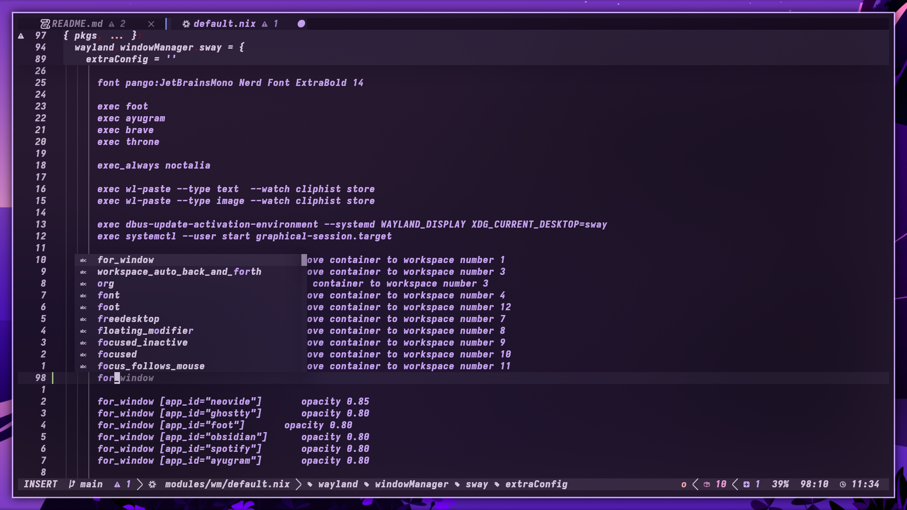
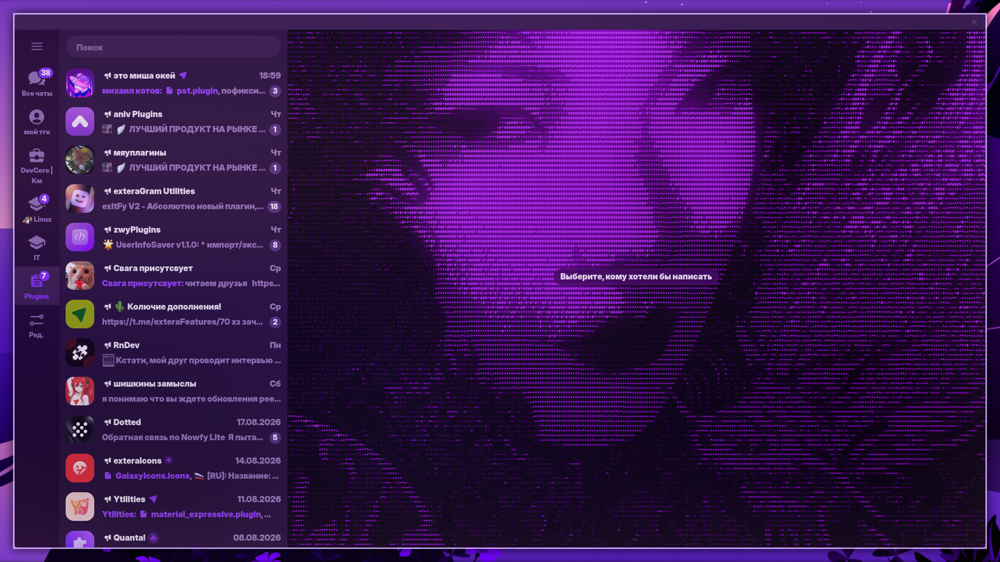
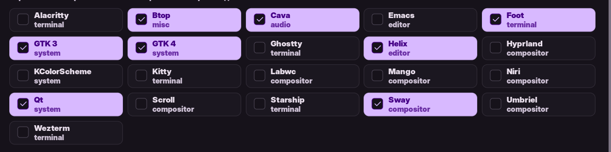

# My SwayFX dots

# Screenshots

<table style="border-collapse: collapse; border: none; border-spacing: 10px; margin-top: 10px; width: 100%;">
  <tr style="border: none;">
    <td style="border: none; padding: 5px; width: 50%;">
      
    </td>
    <td style="border: none; padding: 5px; width: 50%;">
      
    </td>
  </tr>
  <tr style="border: none;">
    <td style="border: none; padding: 5px; width: 50%;">
      
    </td>
    <td style="border: none; padding: 5px; width: 50%;">
      
    </td>
  </tr>
</table>


## My tools

**Term:** foot

**Shell:** Zsh

**Editor:** Neovim + Neovide ( cfg Neovim - LazyVim )

**Bar:** Noctalia shell V5
## Themes
**Catpuccin Mocha Mauve** ( [Palette](https://catppuccin.com/palette/) )

**powerlevel10k** - shell
#### Utility Themes
the color scheme for utilities is determined by the Noctalia template ( M3 Content ). they dont have a dot theme

## Fonts
**Inter Variable Black** ( GTK & QT )

**Iosevka Heavy Extended Oblique** ( Term & Neovide )
```nix
{ pkgs, ... }:
{
  fonts.packages = with pkgs; [
    pkgs.inter
    pkgs.iosevka
  ];
}
```
